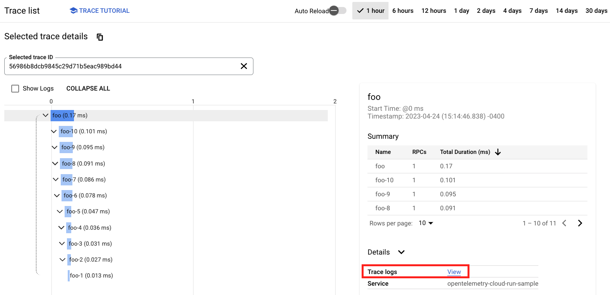
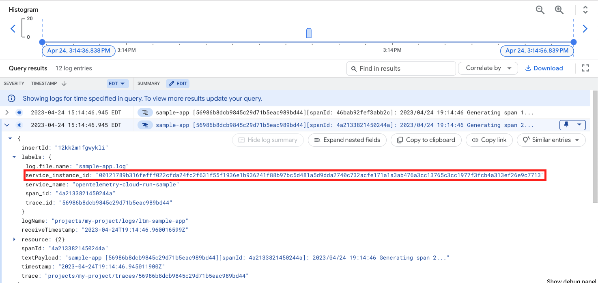
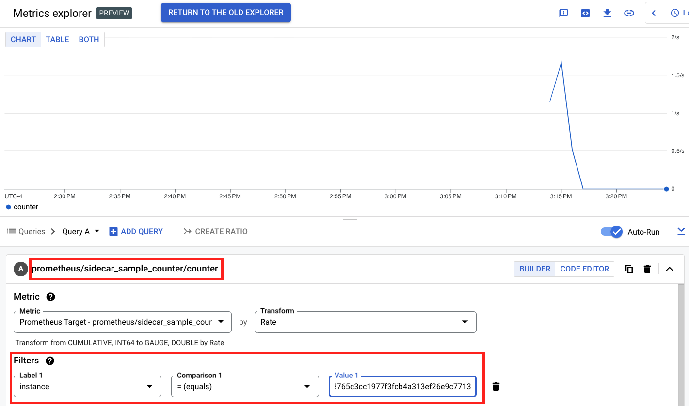

# Deploy a Cloud Run Service with OpenTelemetry

This guide shows how to run the OpenTelemetry Collector to collect metrics,
traces, and logs in a Cloud Run deployment. This uses the **Cloud Run
multicontainer (sidecar) feature** to run the Collector as a sidecar container
alongside your workload container.

[Learn more about sidecars in Cloud Run (currently a preview feature)
here.](https://cloud.google.com/run/docs/deploying#multicontainer)

## Getting started

The following steps walk you through setting up a sample app on Cloud Run that
exports telemetry data to GMP and Cloud Trace.

### Prerequisites

* Enable the Cloud Run API in your GCP project.
* Enable the Artifact Registry API in your GCP project.
* Authenticate with your GCP project in a local terminal.

To run the sample app, you will also need to make sure your [Cloud Run Service
Account](https://cloud.google.com/run/docs/configuring/service-accounts) has, at
minimum, the following IAM roles:

* `roles/monitoring.metricWriter`
* `roles/cloudtrace.agent`
* `roles/logging.logWriter`

The default Compute Engine Service Account has these roles already.

### Build the sample app

The `app` directory contains a sample app written in Go. This app generates some
simple metrics, traces, and writes logs to a local file. It is instrumented with
OpenTelemetry libraries to push that telemetry data to an OpenTelemetry
Collector endpoint.

Create an Artifact Registry container image repository with the following
commands:

```
export GCP_PROJECT=<project-id>
gcloud artifacts repositories create run-otel-example \
    --repository-format=docker \
    --location=us-east1
```

Authenticate your Docker client with `gcloud`:
```
gcloud auth configure-docker \
    us-east1-docker.pkg.dev
```

Build and push the app with the following commands:

```
pushd app
docker build -t us-east1-docker.pkg.dev/$GCP_PROJECT/run-otel-example/sample-app .
docker push us-east1-docker.pkg.dev/$GCP_PROJECT/run-otel-example/sample-app
popd
```

### Build the Collector image

The `collector` directory contains a Dockerfile and OpenTelemetry Collector
config file. The Dockerfile builds a Collector image that bundles the local
config file with it.

Build the Collector image with the following commands:

```
pushd collector
docker build -t us-east1-docker.pkg.dev/$GCP_PROJECT/run-otel-example/collector .
docker push us-east1-docker.pkg.dev/$GCP_PROJECT/run-otel-example/collector
popd
```

### Create the Cloud Run Service

The `run-service.yaml` file defines a multicontainer Cloud Run Service with the
sample app and Collector images built above.

Replace the `%SAMPLE_APP_IMAGE%` and `%OTELCOL_IMAGE%` placeholders in
`run-service.yaml` with the images you built above, ie:

```
sed -i s@%OTELCOL_IMAGE%@us-east1-docker.pkg.dev/${GCP_PROJECT}/run-otel-example/collector@g run-service.yaml
sed -i s@%SAMPLE_APP_IMAGE%@us-east1-docker.pkg.dev/${GCP_PROJECT}/run-otel-example/sample-app@g run-service.yaml
```

Create the Service with the following command:

```
gcloud run services replace run-service.yaml
```

This command will return an external URL for your Service’s endpoint. Save this
and use it in the next section to trigger the sample app so you can see the
telemetry collected by OpenTelemetry.

### View telemetry in Google Cloud

Use `curl` to make a request to your Cloud Run Service’s endpoint URL:

```
export SERVICE_URL=<service-url>
curl $SERVICE_URL
```

This should return the following output on success:

```
Logged request to /logging/sample-app.log
Generated 10 spans!
Updated sidecar-sample-counter metric!
```

(It may be helpful to run the `curl` command several times to produce
more interesting telemetry.)

Navigate to the Cloud Trace UI to see your traces:



Click the **Trace Logs: view** link to see logs automatically associated with
this trace:



Note the `service_instance_id` label that corresponds to the Cloud Run instance
that produced this log line. Copy that value, then search for it in the Cloud
Monitoring Metrics Explorer UI under the metric named `sidecar_sample_counter`:



## What’s next?

This pattern can be applied to run any OpenTelemetry Collector in Cloud Run. The
[`configs`](configs/) directory contains a few more Collector configs that can
be applied to common use cases in GCP.

To use these configs, replace `collector/collector-config.yaml` with the file
you want and follow the steps above starting from Build the Collector Image to
bundle and deploy your new config.
