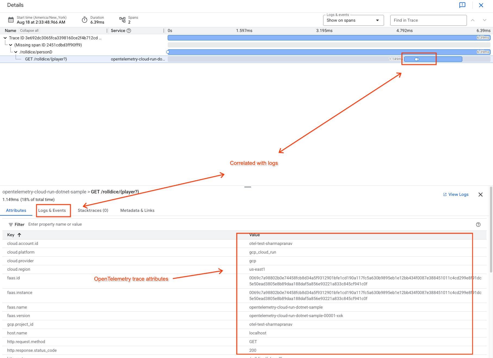

# Deploy a .NET Cloud Run Service with OpenTelemetry

This guide shows how to run an OpenTelemetry instrumented service written in C# (.NET)
on Google Cloud Run and export the generated telemetry (metrics, logs, and traces)
to Google Cloud Observability using OpenTelemetry collector running as a sidecar.

[Learn more about sidecars in Cloud Run here.](https://cloud.google.com/run/docs/deploying#sidecars)

## Getting started

The following steps walk you through setting up a sample app on Cloud Run that
exports telemetry data to GMP and Cloud Trace.

### Prerequisites

* Enable the Cloud Run API in your Google Cloud project.
* Enable the Artifact Registry API in your Google Cloud project.
* Authenticate with your Google Cloud project in a local terminal.

To enable the depending service APIs with `gcloud` command, you can the following commands.

```console
gcloud services enable run.googleapis.com --quiet
gcloud services enable artifactregistry.googleapis.com --quiet
gcloud services enable telemetry.googleapis.com --quiet
gcloud services enable monitoring.googleapis.com --quiet
```

To run the sample app, you will also need to make sure your [Cloud Run Service
Account](https://cloud.google.com/run/docs/configuring/service-accounts) has, at
minimum, the following IAM roles:

* `roles/monitoring.metricWriter`
* `roles/cloudtrace.agent`
* `roles/logging.logWriter`

The default Compute Engine Service Account has these roles already.

### Run sample

#### Cloud Build

Because this sample requires `docker` or similar container build system for Linux runtime, you can use Cloud Build when you are trying without local Docker support. To enable Cloud Build, you need to enable Cloud Build API in your Google Cloud project.

```console
gcloud services enable cloudbuild.googleapis.com --quiet
```

The bundled configuration file for Cloud Build (`cloudbuild.yaml`) requires a new servcie account with the following roles or stronger:

* `roles/iam.serviceAccountUser`
* `roles/storage.objectViewer`
* `roles/logging.logWriter`
* `roles/artifactregistry.createOnPushWriter`
* `roles/run.admin`

Running `create-service-account.sh` creates a new service account `run-otel-example-sa@<project-id>.iam.gserviceaccount.com` for you. Then launch a Cloud Build task with `gcloud` command.

> [!TIP]
> The service account created using the script is only used for building the application on Google
> Cloud Build. Additionally, this service account can be re-used for building all samples in this
> repository. \
> Note that the Cloud Run service itself uses the default Compute Engine Service Account.

```console
../../create-service-account.sh
gcloud builds submit . --config=cloudbuild.yaml
```

After the build, run the following command to check the endpoint URL.

```console
gcloud run services describe opentelemetry-cloud-run-dotnet-sample --region=us-east1 --format="value(status.url)"
```

### View telemetry in Google Cloud

You can invoke the service using curl command or via the utility script provided in this folder:

```console
CLOUD_RUN_SERVICE_URL=$(gcloud run services describe opentelemetry-cloud-run-dotnet-sample --region=us-east1 --format="value(status.url)")

# This will invoke call the service 5 times with argument "foo"
./loop_curl.sh 5 "${CLOUD_RUN_SERVICE_URL}/rolldice/foo"

# This will invoke call the service 10 times with argument "bar"
./loop_curl.sh 10 "${CLOUD_RUN_SERVICE_URL}/rolldice/bar"
```

> [!TIP]
> Use a higher number of iterations to produce more interesting telemetry.

Navigate to the Cloud Trace UI to see your traces:



Click the **Logs & Events** tab to see logs automatically associated with
this trace:


Note the `task_id` label that corresponds to the Cloud Run instance
that produced this log line.

Navigate to the Metrics Explorer UI to see metrics generated by your application.
Note that the sample application was auto-instrumented by OpenTelemetry so you get some
metrics automatically. For instance `aspnetcore_routing_match_attempts_total`:


### Clean up

After running the demo, please make sure to clean up your project so that you don't consume unexpected resources and get charged.

```console
gcloud run services delete opentelemetry-cloud-run-dotnet-sample --region us-east1 --quiet
gcloud artifacts repositories delete run-otel-example \
  --location=us-east1 \
  --quiet
```
